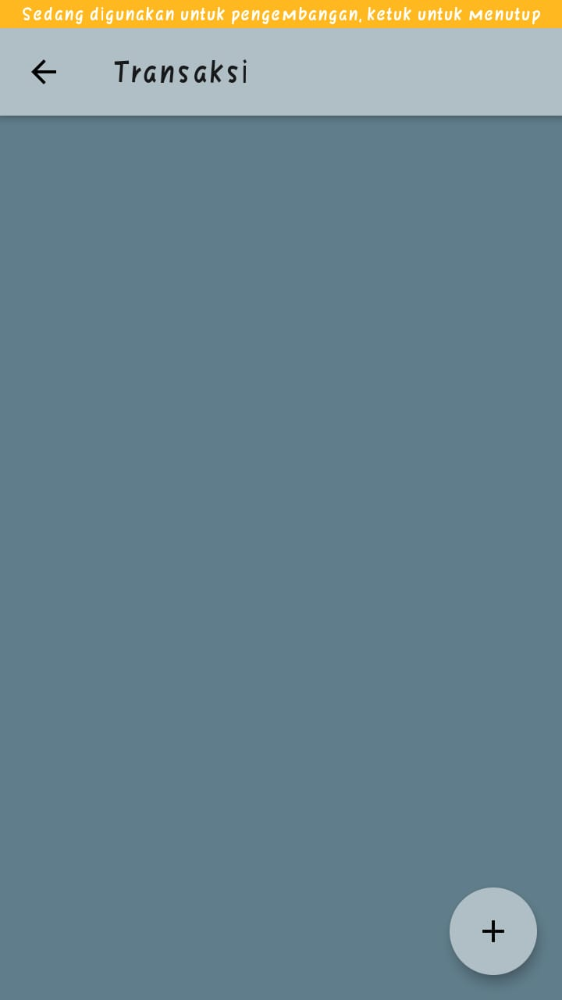

# flutter_uts_catatanorder

Praktikum Pemrograman Mobile UTS ==> Aplikasi Pencatatan Orderan

## Tampilan Awal 

## Customer

## Tambah Data Customer

  
   
  

## Edit Data Customer (Klik Icon Edit) => (Edit Kolom Nama)

  
   

## Hapus Data Customer (Klik Icon Trash)

  
   

## Transaksi

## Tambah Data Transaksi

  
   
  

## Edit Data Transaksi (Klik Icon Edit) => (Edit Kolom Status Pembayaran)

  
   

## Hapus Data Transaksi (Klik Icon Trash)

  
   

